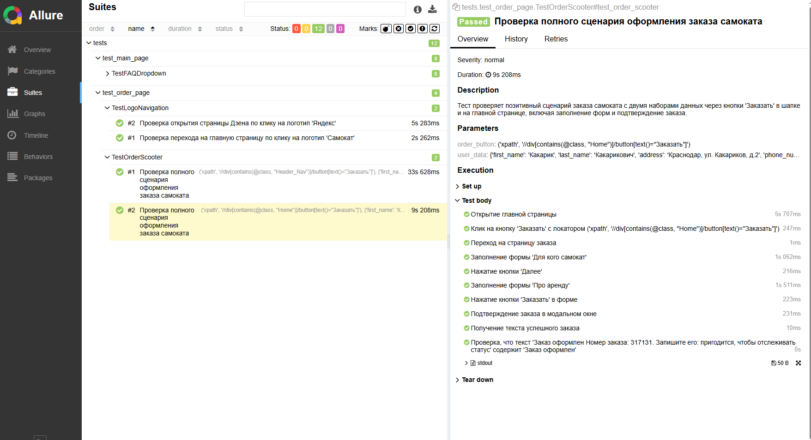

# QA Python Sprint 6
# Автоматизация тестирования сайта "Самокат"

Этот проект содержит автотесты для сайта "Самокат" (https://qa-scooter.praktikum-services.ru/), написанные с использованием **Selenium WebDriver**, **Pytest** и паттерна **Page Object Model (POM)**. Тесты проверяют ключевые функциональности сайта, включая FAQ, оформление заказа и навигацию по логотипам.

## Структура проекта
- **`locators/`**: Классы с локаторами для страниц (например, `MainPageLocators`, `OrderPageLocators`).
- **`pages/`**: Классы страниц с методами взаимодействия (например, `MainPage`, `OrderPage`).
- **`tests/`**: Тестовые классы, разделенные по функциональности (`TestFAQDropdown`, `TestOrderScooter`, `TestLogoNavigation`).
- **`data.py`**: Тестовые данные (пользователи, ожидаемые тексты FAQ и т.д.).
- **`urls.py`**: URL-адреса, используемые в тестах.

## Тестовые сценарии
1. **Проверка FAQ**:
   - Проверка каждого вопроса в разделе "Вопросы о важном" на корректное отображение текста ответа.
2. **Оформление заказа**:
   - Позитивный сценарий заказа самоката с двумя наборами данных через кнопки "Заказать" в шапке и на главной странице.
3. **Навигация по логотипам**:
   - Проверка перехода на главную страницу "Самокат" по клику на логотип.
   - Проверка открытия главной страницы "Дзен" в новой вкладке по клику на логотип "Яндекс".

- ### Страница с проведенными тестами
<p align="center">

</p>

## Требования
- Python 3.8+
- Selenium WebDriver
- Pytest
- Allure-Pytest (для отчетов)
- WebDriver для выбранного браузера (Chrome или Firefox)

## Установка
1. Склонируйте репозиторий:
   ```bash
   git clone <URL_репозитория>
   
2. Установите зависимости 
   ```bash
   pip install -r requirements.txt


## Запуск 
1. Запуск в Chrome
   ```bash
   pytest -v --browser chrome
2. Запуск в Firefox (по умолчанию)
   ```bash
   pytest -v 
   

## Генерация отчета Allure

1. Запустите тесты с сохранением результатов с браузером по умолчанию:
   ```bash
   pytest --alluredir=./allure-results
2. Запустите тесты с сохранением результатов в chrome    
   ```bash
   pytest --browser chrome --alluredir=./allure-results
3. Сгенерируйте и откройте отчет
   ```bash
   allure serve ./allure-results

### Примечание: Тест оформления заказа ожидаемо падает в Chrome из-за особенностей поведения браузера на сайте